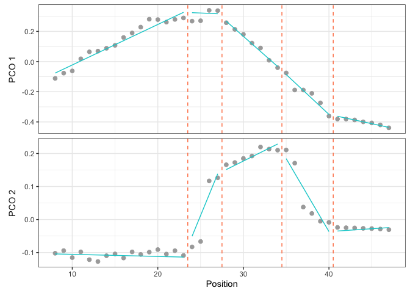
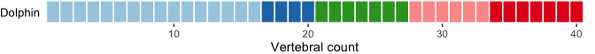
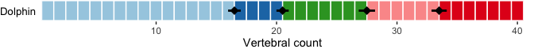

<!-- README.md is generated from README.Rmd. Please edit that file -->

# *MorphoRegions*: Analysis of Regionalization Patterns in Serially Homologous Structures

<!-- badges: start -->
<!-- badges: end -->

*MorphoRegions* is an R package built to computationally identify
regions (morphological, functional, etc.) in serially homologous
structures such as, but not limited to, the vertebrate backbone. Regions
are modeled as segmented linear regressions with each segment
corresponding to a region and region boundaries (or breakpoints)
corresponding to changes along the serially homologous structure. The
optimal number of regions and their breakpoint positions are identified
using maximum-likelihood methods without *a priori* assumptions.

This package was first presented in [Gillet et
al. (2024)](https://www.biorxiv.org/content/10.1101/2024.03.15.585285v1)
and is an updated version of the [*regions* R
package](https://github.com/katrinajones/regions) from [Jones et
al. (2018)](https://www.science.org/doi/abs/10.1126/science.aar3126)
with improved computational methods and expanded fitting and plotting
options.

## Installing *MorphoRegions*

You can install the released version of *MorphoRegions* from
[CRAN](https://CRAN.R-project.org/package=MorphoRegions) with:

``` r
install.packages("MorphoRegions")
```

Or the development version from
[GitHub](https://github.com/AaGillet/MorphoRegions) with:

``` r
# install.packages("remotes")
remotes::install_github("AaGillet/MorphoRegions")
```

## Example

The following example illustrates the basic steps to prepare the data,
fit regionalization models, select the best model, and plot the results.
See `vignette("MorphoRegions")` or the [*MorphoRegions*
website](https://aagillet.github.io/MorphoRegions/) for a detailed guide
of the package and its functionalities.

``` r
library(MorphoRegions)
```

#### Preparing the data

Data should be provided as a dataframe where each row is an element of
the serially homologous structure (e.g., a vertebra). One column should
contain positional information of each element (e.g., vertebral number)
and other columns should contain variables that will be used to
calculate regions (e.g., morphological measurements). The `dolphin`
dataset contains vertebral measurements of a dolphin with the positional
information (vertebral number) in the first column.

``` r
data("dolphin")
```

|     | Vertebra |   Lc |   Wc |   Hc |  Hnp |  Wnp |  Inp |   Ha |   Wa |   Lm |   Wm |  Hm | Hch | Wch |  Ltp |  Wtp |  Itp |
|:----|---------:|-----:|-----:|-----:|-----:|-----:|-----:|-----:|-----:|-----:|-----:|----:|----:|----:|-----:|-----:|-----:|
| 8   |        8 | 1.33 | 3.37 | 2.02 | 2.85 | 1.17 | 2.01 | 1.72 | 1.48 | 0.00 | 0.00 | 0.0 |   0 |   0 | 1.71 | 1.67 | 1.57 |
| 9   |        9 | 1.46 | 3.67 | 2.10 | 3.20 | 1.63 | 2.01 | 1.44 | 1.65 | 0.00 | 0.00 | 0.0 |   0 |   0 | 1.51 | 1.61 | 1.57 |
| 10  |       10 | 1.57 | 3.62 | 2.26 | 3.13 | 1.71 | 2.01 | 1.42 | 2.18 | 0.00 | 0.00 | 0.0 |   0 |   0 | 1.06 | 1.90 | 1.57 |
| 11  |       11 | 1.71 | 3.75 | 2.24 | 3.07 | 1.71 | 2.01 | 1.38 | 1.25 | 0.56 | 0.38 | 1.7 |   0 |   0 | 1.03 | 1.91 | 1.66 |
| 12  |       12 | 1.74 | 3.72 | 2.28 | 2.66 | 1.96 | 1.99 | 1.30 | 1.50 | 1.45 | 1.09 | 2.0 |   0 |   0 | 0.60 | 1.71 | 1.57 |
| 13  |       13 | 1.82 | 3.92 | 2.28 | 2.61 | 1.74 | 1.88 | 1.29 | 1.74 | 1.86 | 1.12 | 2.0 |   0 |   0 | 0.37 | 1.44 | 1.57 |

Prior to analysis, data must be processed into an object usable by
*MorphoRegions* using `process_measurements()`. The `pos` argument is
used to specify the name or index of the column containing positional
information and the `fillNA` argument allows to fill missing values in
the dataset (up to two successive elements).

``` r
dolphin_data <- process_measurements(dolphin, pos = 1)
class(dolphin_data)
#> [1] "regions_data"
```

Data are then ordinated using a Principal Coordinates Analysis (PCO) to
reduce dimensionality and allow the combination of a variety of data
types. The number of PCOs to retain for analyses can be selected using
`PCOselect()` (see the vignette for different methods of PCO axes
selection).

``` r
dolphin_pco <- svdPCO(dolphin_data, metric = "gower")

# Select PCOs with variance > 0.05 :
PCOs <- PCOselect(dolphin_pco, method = "variance",
                  cutoff = .05)
PCOs
#> A `regions_pco_select` object
#> - PCO scores selected: 1, 2
#> - Method: variance (cutoff: 0.05)
```

#### Fitting regressions and selecting the best model

The `calcregions()` function allows fitting all possible combinations of
segmented linear regressions from 1 region (no breakpoint) to the number
of regions specified in the `noregions` argument. In this example, up to
5 regions (4 breakpoints) will be fitted along the backbone, however,
there is no limit for this value and it is possible to fit as many
regions as you would like. For this example, regions will be fitted with
a minimum of 3 vertebrae per region (`minvert = 3`) and using a
continuous fit (`cont = TRUE`) (see `vignette("MorphoRegions")` or
[*MorphoRegions* website](https://aagillet.github.io/MorphoRegions/) for
details about fitting options).

``` r
regionresults <- calcregions(dolphin_pco, scores = PCOs, noregions = 5,
                             minvert = 3, cont = TRUE, 
                             exhaus = TRUE, verbose = FALSE)
regionresults
#> A `regions_results` object
#>  - number of PCOs used: 2 
#>  - number of regions: 1, 2, 3, 4, 5 
#>  - model type: continuous 
#>  - min vertebrae per region: 3 
#>  - total models saved: 28810 
#> Use `summary()` to examine summaries of the fitting process.
```

For each given number of regions, the best fit is selected by minimizing
the residual sum of squares (`sumRSS`):

``` r
models <- modelselect(regionresults)
models
#>  Regions BP 1 BP 2 BP 3 BP 4 sumRSS RSS.1 RSS.2
#>        1    .    .    .    .  1.898 1.456 0.441
#>        2   26    .    .    .  0.413 0.105 0.308
#>        3   23   29    .    .  0.147 0.092 0.055
#>        4   23   30   40    .  0.073 0.034 0.040
#>        5   23   27   34   40  0.046 0.026 0.020
```

The best overall model (best number of regions) is then select by
ordering models from the best fit (top row) to the worst fit (last row)
using either the AICc or BIC criterion:

``` r
supp <- modelsupport(models)
supp
#> - Model support (AICc)
#>  Regions BP 1 BP 2 BP 3 BP 4 sumRSS     AICc deltaAIC model_lik Ak_weight
#>        5   23   27   34   40  0.046 -556.036    0.000         1         1
#>        4   23   30   40    .  0.073 -528.096   27.940         0         0
#>        3   23   29    .    .  0.147 -480.952   75.084         0         0
#>        2   26    .    .    .  0.413 -405.787  150.250         0         0
#>        1    .    .    .    .  1.898 -290.769  265.267         0         0
#> Region score: 5 
#> 
#> - Model support (BIC)
#>  Regions BP 1 BP 2 BP 3 BP 4 sumRSS      BIC deltaBIC model_lik BIC_weight
#>        5   23   27   34   40  0.046 -526.559    0.000         1          1
#>        4   23   30   40    .  0.073 -502.645   23.914         0          0
#>        3   23   29    .    .  0.147 -460.321   66.238         0          0
#>        2   26    .    .    .  0.413 -390.668  135.891         0          0
#>        1    .    .    .    .  1.898 -281.774  244.784         0          0
#> Region score: 5
```

Here, for both criteria, the best model is the 5 regions models with
breakpoints at vertebrae 23, 27, 34, and 40. *The breakpoint value
corresponds to the last vertebra included in the region, so the first
region here is made of vertebrae 8 to 23 included and the second region
is made of vertebrae 24 to 27.* The function also returns the **region
score**, a continuous value reflecting the level of regionalization
while accounting for uncertainty in the best number of regions (see
`vignette("MorphoRegions")` or [*MorphoRegions*
website](https://aagillet.github.io/MorphoRegions/) for more details).

#### Plotting results

Results of the best model (or any other model) can be visualized either
as a scatter plot or as a vertebral map.

The **scatter plot** shows the PCO score (here for PCO 1 and 2) of each
vertebra along the backbone (gray dots) and the segmented linear
regressions (cyan line) of the model to plot. Breakpoints are showed by
dotted orange lines.

``` r
plotsegreg(dolphin_pco, scores = 1:2, modelsupport = supp,
           criterion = "bic", model = 1)
```



In the **vertebral map** plot, each vertebra is represented by a
rectangle color-coded according to the region to which it belongs.
Vertebrae not included in the analysis (here vertebrae 1 to 7) are
represented by gray rectangles and can be removed using `dropNA = TRUE`.

``` r
plotvertmap(dolphin_pco, name = "Dolphin", modelsupport = supp, 
            criterion = "bic", model = 1)

plotvertmap(dolphin_pco, name = "Dolphin", modelsupport = supp, 
            criterion = "bic", model = 1, dropNA = TRUE)
```



The variability around breakpoint positions can be calculated using
`calcBPvar()` and then displayed on the vertebral map. The weighted
average position of each breakpoint is shown by the black dot and the
weighted variance is illustrated by the horizontal black bar.

``` r
bpvar <- calcBPvar(regionresults, noregions = 5,
                   pct = 0.1, criterion = "bic")

plotvertmap(dolphin_pco, name = "Dolphin", 
            dropNA = TRUE, bpvar = bpvar)
```



## Citation

To cite *MorphoRegions*, please use:

``` r
citation("MorphoRegions")
```
