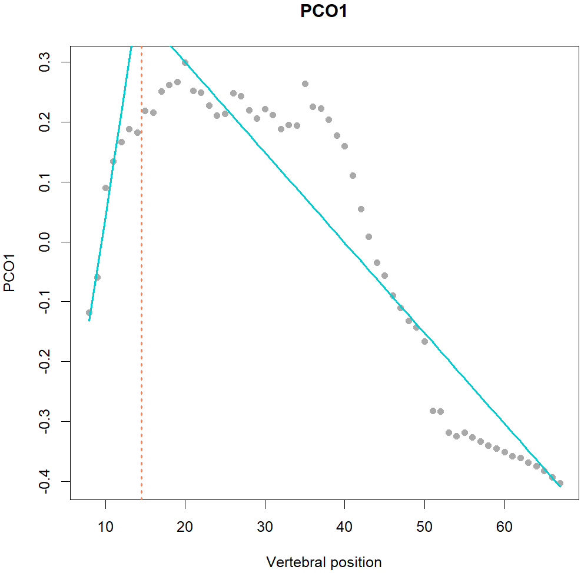

<style>
p.caption {
  font-size: 0.82em;
  text-align: center;
  margin-right: 8% ;
  margin-left: 8% ;
}
img {
  border: 0;
}
</style>


```{r, include=FALSE}
knitr::opts_chunk$set(echo = TRUE,
                      collapse=TRUE,
                      comment="#>",
                      fig.width=5.5, 
                      fig.height=4,
                      fig.align = "center")
```

```{r setup, include=F}
library(MorphoRegions)
```


## About *MorphoRegions*

The *MorphoRegions* package is built to **computationally identify regions** (morphological, functional, etc.) **in serially homologous structures** such as, but not limited to, the vertebrate backbone. Regions are modeled as segmented linear regressions with each segment corresponding to a region and region boundaries (or breakpoints) corresponding to changes along the serially homologous structure. The optimal number of regions and their breakpoint positions are identified without *a priori* assumptions. The algorithm fits increasingly complex models (increasing number of regions). For each given number of regions, all possible combinations of breakpoint positions will be iteratively fitted. Maximum-likelihood methods are then used to identify the best model, as described in @GilRev. 


```{r images, fig.show = "hold", out.width = "30%", fig.cap="**Fig.1.** *MorphoRegions* identifies regions in serially-homologous structures by fitting all possible breakpoint positions for a given number of region and then repeating the method on increasingly complex models.",echo=F}

knitr::include_graphics("images/Regions_image2.jpg")




```

<br>
This package is an updated version of the [*regions* R-package](https://github.com/katrinajones/regions) from @Jones2018 which expanded on previous work from @Head2015.
This package provides improved computational methods (reduced time and memory usage) allowing application to larger datasets. Several features have been added including the options to perform non-exhaustive searches, run parallel computing, choose between continuous and discontinuous fitting methods, define the minimum number of vertebrae in each region, select the best model using either AICc or BIC, and fit a model to multiple specimens. Plotting options have also been expanded.

<br>

## Package installation 

The package is available on CRAN and can be installed and loaded using the following code:

```{r, eval=F}
install.packages("MorphoRegions")
library(MorphoRegions)
```

```{r, include=F}
library(MorphoRegions)
```

## Preparing the data

Data should be provided as a dataframe where each row is an element of the serially-homologous structure (e.g., a vertebra). One column should contain positional information of each element (e.g., vertebral number) and other columns should contain variables that will be used to calculate regions (e.g., morphological measurements).

The package comes with **four built-in datasets**. `alligator`, `musm`, and `dolphin` contain measurements on the vertebrae of an alligator, mouse, and dolphin. `porpoise` contains vertebral measurements of three specimens of harbor porpoises and can be used to test fitting a single model for multiple specimens together   ([see below](#IntraSp)). *Alligator and mouse data are from @Jones2018; dolphin and porpoise data are from @Gillet2022.*


```{r, results="hold"}
data("dolphin")

head(dolphin)
```

In the `dolphin` dataset, the first column contains positional information (vertebral number) while other columns contain morphological measurements taken on each vertebra.

**Prior to analysis, data must be processed into an object usable by `regions` using `process_measurements()`. Data should be provided as a dataframe**. The `pos` argument is used to specify the name or index of the column containing positional information; if unspecified, the first column will be used by default. Names or indices of columns containing variables can be specified with the `measurements` argument.
The `fillNA` argument allows to fill missing values in the dataset. Missing values can be filled for up to two successive elements (e.g., up to two successive vertebrae) using a linear imputation (see @Jones2018 for more details). The `fillNA` argument is set to `TRUE` by default.


```{r}
dolphin_data <- process_measurements(dolphin, pos = 1)
class(dolphin_data)
```

## Data ordination {#PCO}

To allow the analysis of high dimensional datasets, including a variety of data types, a **Principal Coordinates Analysis (PCO)**, a distance-based data ordination method, is implemented in `svdPCO()`. The function relies on a distance matrix generated by `cluster::daisy()`, which tolerates missing values. Three types of distance metric can be used: Euclidean, Manhattan, or Gower. Euclidean should only be used where all variables are similar (e.g., linear measures on the same scale), and is most similar to a PCA. Gower is good for combining different types of continuous data (e.g., angles and linear).

```{r}
dolphin_pco <- svdPCO(dolphin_data, metric = "gower")
```

PCO scores of each vertebra can be plotted along their respective position in backbone (left) or as a morphospace (right).

```{r,fig.show = "hold", out.width = "48%", fig.cap= "**Fig.2.** *Left*: PCO scores of each vertebra along the backbone for PCO1 *(top)* and PCO2 *(bottom)*. *Right*: morphospace defined by PCO1 and 2, points plotted as numbers corresponding to the position of each vertebra along the backbone."}
#Plot PCOs along backbone for PC1 and 2:
plot(dolphin_pco, 1:2)

# Plot morphospace of PC1 and 2:
plot(dolphin_pco, pco_x = 1, pco_y = 2)
```

### Data reduction

While the regionalization analysis can be performed on all PCO axes, it's likely that lower PCO axes mostly contain noise. The number of PCO axes to retain for analysis can be selected using `PCOselect()`.

**Four different methods to select PCOs** are available and be specified using the `method` argument: 

- `"manual"`: the number of PCOs is directly defined via the `scores` argument
- `"variance"`: PCO axes with a variance (defined as the ratio between the eigenvalue of the given axis and the sum of all eigenvalues) higher to the `cutoff` value (expressed as a value between 0 and 1) are retained
- `"max"`: PCOs axes needed to obtain the maximum number of regions in the segmented models tested which must be supplied to `results`. The criterion (AICc or BIC) used to maximize the region score should be defined with `criterion` 
- `"boot"`: PCO axes are selected through bootstrapping by comparing observed eigenvalues to eigenvalues from randomized data and retaining PCO axes with eigenvalues higher than values from randomized data. When using this method, the screeplot showing observed and simulated eigenvalues can be plotted. *Note that bootstrapping is sensitive to unequal variances of variables and should only be used on data that have been scaled (setting `scale = TRUE` in the original call to `svdPCO()`).*

```{r, fig.show='all', out.width = '60%',fig.align='center'}
# Manual (keeping axes 1 to 3):
PCOs <- PCOselect(dolphin_pco, method = "manual",
                  scores = 3)
PCOs

# Variance (selecting axes with variance > 0.05):
PCOs <- PCOselect(dolphin_pco, method = "variance",
                  cutoff = .05)
PCOs
```

```{r, fig.show='all', out.width = '60%',fig.align='center', fig.cap="**Fig.3a.** Graph of region scores (left y-axis) and cumulative variance (right y-axis) obtained with varying number of PCO axes included for AICc (left graph) and BIC (right graph). Blue triangles correspond to region score obtained for each individual PCO axis and orange circle to region scores obtained with cumulative number of PCO axes. The cumulated variance explained by PCO axes is represented by the grey curve."}
# Max:
regionresults <- calcregions(dolphin_pco, scores = 1:39, noregions = 4, 
                             minvert = 3, cont = TRUE, exhaus = TRUE,
                             verbose = FALSE)
PCOs <- PCOselect(dolphin_pco, method = "max",
                  results = regionresults,
                  criterion = "bic")
PCOs
plot(PCOs)
```

```{r, fig.show='all', out.width = '60%',fig.align='center', fig.cap="**Fig.3b.** Screeplot of observed eigenvalues (line) and eigenvalues from randomized data (boxes). Here PCO axes 1 and 2 are retained for subsequent analyses."}
# Bootstrap:
PCOs <- PCOselect(dolphin_pco, method = "boot")
PCOs
plot(PCOs)
```


### Loadings

Correlations between original variables and each PCO axis are obtained through the `PCOload` function. The additional 'Size' variable corresponds to the mean value of the variables.

```{r, out.width = '70%',fig.align='center', fig.cap="**Fig.4.** Correlations between original variables and PCO axes 1 and 2."}
loadings <- PCOload(dolphin_pco, scores = PCOs)
plot(loadings)
```

<br>

## Regionalization analysis

The regionalization analysis is performed in three steps:

1. Fitting all possible models for all number of regions requested

2. Selecting the best model for each number of regions tested 

3. Selecting the overall best model


### Fitting segmented linear regressions {#SegRegFit}

`calcregions()` fits all possible combinations of breakpoints (boundaries between successive regions) for each number of regions to be tested. The analysis will fit models on PCO scores, so the output of `svdPCO()` needs to be provided. The number of PCOs to keep (supplied either as a vector or as the output of `PCOselect()`), and the maximum number of regions to test need to be provided with the `scores` and `noregions` arguments, respectively.


The function also offers **several optional arguments** (see the [Model fitting options](#FittingOptions) section for details):

- `minvert`: define the minimum number of vertebrae (elements) in each region  ([see here](#MinVert))
- `cont`: choose to fit either a continuous fit (`TRUE`) or discontinuous fit (`FALSE`) ([see here](#ContDisc))
- `includebp`: force breakpoint(s) to fall at the supplied value(s) ([see here](#ForceBP))
- `omitbp`: exclude breakpoint(s) falling at the supplied value(s) ([see here](#ForceBP))
- `exhaus`: either to fit all possible combinations (`TRUE`) or only the most probable ones (`FALSE`) to reduce computing time ([see here](#Exhaus))
- `cl`: option to use parallel computation ([see here](#Para))

```{r}
regionresults <- calcregions(dolphin_pco, scores = PCOs, noregions = 5,
                             minvert = 3, cont = TRUE, 
                             exhaus = TRUE, cl = NULL,
                             verbose = FALSE)
```

The output of the function contains information on the parameters used to run the analysis and total number of models tested while using the `summary` function allows to see how many models are possible and how many have been tested for each given number of regions.

```{r}
regionresults
summary(regionresults)
```


### Selecting best model for each number of regions

`modelselect()` retains the best model for each number of regions tested. The best models are selected as the ones with the lowest residual sum of squares (RSS).

```{r}
models <- modelselect(regionresults)
models
```

Each row of the output corresponds to the best model for a given number of regions. Columns named `BP` give the position of region boundaries (or breakpoints), each value corresponding to the position of the last element (vertebra) of a given region. The other columns provide the total residual sum of squares across all PC axes (`sumRSS`) and the residual sum of square for each PC axis individually (`RSS.`).

In the example above, in the model with three regions, the first region encompasses vertebrae 8 (first vertebra in the dataset) to 23, the second contains vertebrae 24 to 29, and the last region contains vertebrae 30 to 47 (last vertebra in the dataset).


### Selecting best overall model and region score

`modelsupport()` will find the best overall models across the models returned by `modelselect()`. The best model is **calculated using AICc or BIC** which allows the selection of the best fit model while penalizing for models that are too complex. *See @Jones2018 for AICc calculations and @GilRev for BIC calculations.* 

```{r}
supp <- modelsupport(models)
supp
```

**Models are ordered from best to worst fit**. Here, both AICc and BIC find the model with 5 regions as the best overall model with the following regions: *region1*: vertebrae 8 to 23, *region2*: vertebrae 24 to 27, *region3*: 28 to 34, *region4*: 35 to 40, *region5*: 41 to 47.

In addition to returning the best models, the function also calculates the **region score**, a continuous value accounting for the fact models with different number of regions could fit the data well. The region score is calculated as the sum of the number of region in each model weighted by their respective AICc/BIC weight. In this example, the region score for BIC is calculated as $5*1 + 4*0 + 3*0 + 2*0 + 1*0=5$.


### Adding more regions

In the example above, the model with 5 regions is by far the best one (AICc/BIC weight = 1). In such cases where the most complex model is the best model, it's likely that more complex models fit the data better. `addregions()` allows one to **fit additional models without the need to recompute models with fewer regions**.

```{r}
regionresults <- addregions(regionresults, noregions = 6:7, exhaus = TRUE,
                            verbose = FALSE)
summary(regionresults)
```

Identifying the best model now that models with 6 and 7 regions have been added:

```{r}
models <- modelselect(regionresults)
supp <- modelsupport(models)
supp
```

The best overall model now is the model with 7 regions both when using AICc and BIC. Since the best model is still the most complex model, additional model(s) with more than seven regions should be fitted (not run here for computational reasons).


### Model performance ($R^2$)

`modelperf()` returns the univariate (for each PC axis individually) and multivariate (all PC axes) $R^2$ and adjusted $R^2$ for a given model. The $R^2$ can be calculated for the best model (`model = 1`) for a given criterion (`criterion` argument), but also the second best (`model = 2`), third best (`model = 3`), etc. In this case, the output of `modelsupport()` must be supplied.

```{r}
modelperf(dolphin_pco, scores = PCOs, modelsupport = supp,
          criterion = "bic", model = 1)
```

Alternatively, it is also possible to calculate the $R^2$ for a user-defined model using the `bps` argument specifying the position of breakpoints (region boundaries) of the model to test.

```{r}
modelperf(dolphin_pco, scores = 1:3,
          bps = c(15, 24, 37), criterion = "bic")
```


### Breakpoint position variability

`calcBPvar()` calculates the variability in breakpoint position for a given number of regions (`noregions` argument) using weighted means and standard deviation based either on AICc or BIC weight (defined by `criterion` argument). The variability can be calculated on a given proportion of best models across all fitted models from this number of regions (`pct` argument). 

Here is an example of calculating the variability of breakpoint positions for models with 7 regions, using the top 10% best models evaluated with the BIC criterion.

```{r}
bpvar <- calcBPvar(regionresults, noregions = 7,
                   pct = 0.1, criterion = "bic")
bpvar
```

Note that when using output from `calcBPvar` for plotting, breakpoint positions will be rounded to the closest whole number. In the example above, breakpoints will then be 19, 24, 26, 35, 38, and 41. Since `calcregions` only returns whole numbers as breakpoint values, a weighted mean breakpoint position of 23.97 involves that most models found a breakpoint value of 24 (corresponding to a region break between vertebrae 24 and 25).

## Visualizing results

*MorphoRegions* offers two main plotting options to visualize the results: 1) scatter plots showing PC scores of each element (vertebra) along the structure (backbone) and the segmented linear regressions, 2) vertebral maps showing the regional identity of each element (vertebra).

### Segmented linear regression plots

The scatter plots of the segmented linear regressions can be plotted using `plotsegreg()`. The output of `svdPCO()` and the number of the PC axis to plot (`scores` argument) must be supplied.

The function can either be used to plot the best (or second best, third best, etc.) model (`model` argument) for a given criterion, by supplying the output of `modelsupport()`. Alternatively, a specific model can also be plotted by providing the position of the breakpoints (`bps` argument).

```{r, fig.show='hold', out.width='48%', fig.cap='**Fig.5.** Scatterplots showing PCO scores and segmented regressions on PC1 and PC2 for the best model *(left)* and on PC1 for a 4 regions model with breakpoints at vertebrae 15, 24, and 37 *(right)*.'}
# Plot regressions for best model:
plotsegreg(dolphin_pco, scores = 1:2,
           modelsupport = supp,
           criterion = "bic",
           model = 1)

# Plot regressions for a specific model:
plotsegreg(dolphin_pco, scores = 1,
           bps = c(15, 24, 37),
           cont = TRUE)
```


### Vertebral maps

`plotvertmap()` produces vertebral maps, which are plots in which each rectangle corresponds to an element (i.e., vertebra) that is color-coded according to the region to which it belongs. The function provides many different plotting options. 

The function requires `regions_data` (from `process_measurements()`), `regions_pco` (from `svdPCO()`), or `regions_sims` (from `simregions()`; see below) to be provided. The positional information of each element (i.e., vertebral number) will be extracted from one of these objects.

The regional identity of each element can be defined either by providing a `regions_modelsupport` object (from `modelsupport()`) or by directly specifying the position of breakpoints of a model.

```{r, fig.width=7, fig.height=0.7, fig.show='hold', fig.align='center', fig.cap='**Fig.6.** Vertebral maps of the best fit model using BIC criterion *(top)*, the 2^nd^ best fit model using AICc criterion *(middle)*, a user-defined model with breakpoints at vertebrae 12, 17, 20, and 30 *(bottom)*.'}
#Plot vertebral map using best BPs from modelsupport (BIC)
plotvertmap(dolphin_pco, name = "Dolphin A",
            modelsupport = supp, criterion = "bic", model = 1)

#Plot vertebral map using 2nd best BPs from modelsupport (AICc)
plotvertmap(dolphin_pco, name = "Dolphin B",
            modelsupport = supp, criterion = "aic", model = 2)

#Plot vertebral map using arbitrary breakpoints
plotvertmap(dolphin_pco, name = "Dolphin C",
            bps = c(12, 17, 20, 30))

```

Here the seven first elements (rectangles corresponding each to one vertebra) are grayed as they were not included in the analyses. It is possible to hide elements excluded from the analyses by setting the `dropNA` argument to `TRUE`.

**Variability in breakpoint positions** between regions can also be added either by supplying a `regions_BPvar` object (from `calcBPvar()`) or a user-defined vector. When a `regions_BPvar` object is supplied, the position of breakpoints corresponds to the weighted mean position computed by `calcBPvar()`.

```{r, fig.width=7, fig.height=0.7, fig.show='hold', fig.align='center', fig.cap="**Fig.7.** Vertebral maps showing breakpoint position variability calculated from *calcBPvar (top)* and with values directly supplied to the function *(bottom)*. Dots correspond to breakpoint position and horizontal lines correspond to the standard deviation of each breakpoint position."}
# BP variability from calcBPvar:
plotvertmap(dolphin_pco, name = "Dolphin",
           bpvar = bpvar, dropNA = TRUE)

# BP variability from user-defined vector, plotting SD bars in grey:
plotvertmap(dolphin_pco, name = "Dolphin",
            modelsupport = supp,
            criterion = "bic",
            bp.sd = c(2.2, 1.4, 2.5, 1.5, 2.1, 0.8),
            sd.col="#636363", dropNA = TRUE)
```


To facilitate the interpretation of the regions, the function offers some plotting options.

It is possible to **add other boundaries on the plot**, such as the boundaries between traditional anatomical regions (thoraco-lumbar, lumbo-caudal, etc). Boundary positions can be supplied as a vector to the `reg.lim` argument, with each numeric value corresponding to the position of the last element before the boundary. For example, in the dolphin dataset, the thoraco-lumbar, lumbo-caudal, and caudal-fluke transitions fall between vertebrae 17-18, 25-26, and 35-36, respectively.

It is also possible to plot the **positional info** of each element (vertebra) as a number on the corresponding rectangle.

```{r, fig.width=7, fig.height=0.7, fig.show='hold', fig.align='center', fig.cap="**Fig.8.** Vertebral maps with anatomical region boundaries represented by vertical bars *(top)* and vertebral position labelled on corresponding rectangle *(bottom)*."}
# Remove missing vertebrae, add vertebrae number 
  # and add thoraco-lumbar, lumbo-caudal, and caudal-fluke boundaries:
plotvertmap(dolphin_pco, name = "Dolphin", modelsupport = supp,
            criterion = "bic", dropNA = TRUE,
            reg.lim = c(17 ,25, 35),
            lim.col = c("red", "blue", "green"))

# Add positional info of each vertebra:
plotvertmap(dolphin_pco, name = "Dolphin", modelsupport = supp,
            criterion = "bic", dropNA = TRUE, text = TRUE)
```

By default, the function plots the elements (vertebrae) as count (vertebral count) but it is also possible to **plot elements as percentage of the total number of elements** (by setting `type = "percent"`).

In both cases, each element on the plot will have the same size. Alternatively, it is possible to **scale rectangles on the plot according to the relative size of each element** by supplying a vector containing size information to the `centraL` argument. In the example below, rectangles are scaled according to the centrum length of each vertebra (supplied in the `Lc` column of the original dataset).

```{r, fig.width=7, fig.height=0.7, fig.show='hold', fig.align='center', fig.cap="**Fig.9.** Vertebral maps plotting vertebrae as percentage of total vertebral count *(top)*, scaled to their centrum length relative to total length in absolute value *(middle)*, and scaled to their centrum length in percentage *(bottom)*."}
# Plot vertebrae as percentage of total count:
plotvertmap(dolphin_pco, name = "Dolphin",
            type = "percent",
            modelsupport = supp, criterion = "bic",
            dropNA = TRUE, reg.lim = c(17, 25, 35))

# Scale vertebrae relative to their centrum length (scale in cm):
plotvertmap(dolphin_pco, name = "Dolphin",
            type = "count", centraL = "Lc",
            modelsupport = supp, criterion = "bic",
            dropNA = TRUE, reg.lim = c(17, 25, 35))

# Scale vertebrae relative to their centrum length (scale in % total length):
plotvertmap(dolphin_pco, name = "Dolphin",
            type = "percent", centraL = "Lc",
            modelsupport = supp, criterion = "bic",
            dropNA = TRUE, reg.lim = c(17, 25, 35),
            lim.col = "grey")
```


Finally, it is possible to **change colors used for each region** with the `block.cols` argument. Colors can either be supplied as a vector, in which case regions will be *color-coded following the order of colors supplied in the vector*. 

Alternatively, it's also possible to *define a set of colors per block*, each block being defined by the `block.lim` argument. In this case, colors must be supplied as a named list, each element of the list containing a vector of color for a given block. For instance, for the dolphin data, we could define regions in the precaudal block (thoracic + lumbar) to be colors in shades of beige/brown, while regions in the caudal block (caudal + fluke) to be color in shades of blue. Since the lumbo-caudal transition falls between vertebrae 25 and 26, we'll define two blocks with a limit at vertebra 25.  


```{r, eval = requireNamespace("viridisLite", quietly = TRUE), message=FALSE, fig.width=7, fig.height=0.7, fig.show='hold', fig.align='center', fig.cap="**Fig.10.** Vertebral maps with regions colored with a user-defined palette using *viridis* *(top)* and custom palettes for different blocks *(bottom)*."}
# Manually color-coding each region using the viridis palette:
library(viridisLite)
nreg <- supp$Model_support_BIC[1,1]  # get nbr of regions
cols <- viridis(n = nreg)

plotvertmap(dolphin_pco, name = "Dolphin",
            type = "percent", centraL = "Lc",
            modelsupport = supp, criterion = "bic",
            dropNA = TRUE, 
            reg.lim = c(17, 25, 35),
            block.cols = cols)

# Color code regions by block (precaudal vs caudal):
blockcols <- list(PreCaudal = c("#BF812D","#8C510A","#543005"),
                  Caudal = c("#C7EAE5","#80CDC1","#35978F","#01665E","#236E30"))

plotvertmap(dolphin_pco, name = "Dolphin",
            type = "percent", centraL = "Lc",
            modelsupport = supp, criterion = "bic",
            dropNA = TRUE, 
            reg.lim = c(17, 25, 35),
            block.cols = blockcols, block.lim = 25)
```

*When coloring regions by blocks, regions spanning over more than one block will be allocated to the block in which the majority of its elements belong. In the example above, the 3^rd^ region has one vertebra in the precaudal block and two in the caudal block, thus this region is considered as the 1^st^ region in the caudal block.*

Vertebral maps are created using *ggplot2* meaning that they can be modified similarly to `ggplot` plots. For instance, it is possible to create a single plot with multiple vertebral maps with the *patchwork* package.

```{r, eval = requireNamespace("patchwork", quietly = TRUE), message=FALSE, fig.width=7, fig.height=1.7, fig.show='hold', fig.align='center', fig.cap="**Fig.11.** Vertebral maps of alligator, mouse, and dolphin stacked in a single figure."}
# Run regions analysis on alligator and mouse data:
dat_alligator <- process_measurements(alligator, pos = 1)
pco_alligator <- svdPCO(dat_alligator, "gower")
regions_alligator <- calcregions(pco_alligator, scores = 1:3,
                                 noregions = 5, verbose = FALSE)
supp_alligator <- modelsupport(modelselect(regions_alligator))

dat_mouse <- process_measurements(musm, pos = 1)
pco_mouse <- svdPCO(dat_mouse, "gower")
regions_mouse <- calcregions(pco_mouse, scores = 1:3,
                             noregions = 5, verbose = FALSE)
supp_mouse <- modelsupport(modelselect(regions_mouse))

# Create vertebral maps:
vertmaps <- list(alligator = plotvertmap(pco_alligator, name = "Alligator", centraL = "CL",
                                         modelsupport = supp_alligator, type = "percent",
                                         dropNA = TRUE),
                 mouse = plotvertmap(pco_mouse, name = "Mouse", centraL= "CL", 
                                     modelsupport = supp_mouse, type = "percent",
                                     dropNA = TRUE),
                 dolphin = plotvertmap(dolphin_pco, name = "Dolphin", centraL= "Lc",
                                       modelsupport = supp, type = "percent",
                                       dropNA = TRUE))

# Remove x axis for plots except bottom one:
library(ggplot2)
for (i in seq_along(vertmaps)[-length(vertmaps)]){
  vertmaps[[i]] <- vertmaps[[i]] + theme(axis.text.x = element_blank(),
                                         axis.ticks.x = element_blank(),
                                         axis.title.x = element_blank())
}

# Stack plots together:
library(patchwork)
wrap_plots(vertmaps) + plot_layout(ncol = 1, byrow = FALSE)

```

## Model fitting parameters {#FittingOptions}

As briefly described in the [section above](#SegRegFit), there are several different parameters available when fitting the segmented linear regressions. 

### Continuous _vs._ discontinuous fit {#ContDisc}

While the older *regions* package automatically fitted discontinuous segments, *MorphoRegions* allows users to choose between a continuous or discontinuous fit. In a continuous fit, the first point of the segment aligns with the last point of the preceding segment, modeling gradational variation without large jumps between segments. Because the continuous fit forces continuity between successive segments, it puts more constrains on the model fitting compared to a discontinuous fit. Depending on the dataset, one or the other fitting method might be appropriate. It's advised to visually inspect the distributions of elements along the structure using the PCO scores that will be implemented in the analysis (as in [Fig.2](#PCO)) before choosing an option.

```{r, fig.show='hold', out.width = "48%", fig.cap="**Fig.12.** Best fit on PCOs 1 and 2 of a 4 region models with breakpoints at 15, 24, and 37, using a discontinuous model (*left*) and a continuous model (*right*)."}
# Plot a discontinuous model:
plotsegreg(dolphin_pco, scores = 1:2,
           bps = c(15, 24, 37),
           cont = FALSE)

# Plot a continuous model:
plotsegreg(dolphin_pco, scores = 1:2,
           bps = c(15, 24, 37),
           cont = TRUE)
```


### Minimum number of elements per region {#MinVert}

By default, the minimum number of elements (vertebrae) in each region is set to 3. This parameter can, however, be changed with the `minvert` argument in the `calcregions` function. *Note that setting the minimum value to 2 might results in linear segments made of only two points, which will have a perfect fit (RSS=0 for these segments) and might artificially increase the goodness of fit.*

```{r, fig.show='hold', out.width = "48%", fig.align='center', fig.cap="**Fig.13.** Best fit on PCO 1 of models up to 5 regions with a minimum of 2 vertebrae per region (*left*) or 4 vertebrae per region (*right*)."}
# Fitting up to 5 regions for alligator data with 2 vertebrae minimum per segment:
reg.all.2 <- calcregions(pco_alligator, scores = 1, minvert = 2, noregions = 5,
                         cont = FALSE, verbose = FALSE)
plotsegreg(pco_alligator, scores = 1,
           modelsupport = modelsupport(modelselect(reg.all.2)),
           criterion = "bic")

# Fitting up to 5 regions for alligator data with 4 vertebrae minimum per segment:
reg.all.4 <- calcregions(pco_alligator, scores = 1, minvert = 4, noregions = 5,
                         cont = FALSE, verbose = FALSE)
plotsegreg(pco_alligator, scores = 1,
           modelsupport = modelsupport(modelselect(reg.all.4)),
           criterion = "bic")
```

When setting the minimum number of vertebrae per region to 2, the best fit model (using BIC) is the 5 regions model with RSS = 0.001 and BIC weight = 0.99.

When forcing the minimum number of vertebrae per region to 4, the best fit model (using BIC) is the 4 regions model with RSS = 0.002 and BIC weight = 0.61. The 5 regions model is only the 3^rd^ best model (after the 3 regions model) with RSS = 0.002 and BIC weight = 0.02.


### Forcing or preventing specific breakpoint positions {#ForceBP}

The `omitbp` and `includebp` arguments of `calcregions` allows one to prevent or force breakpoint(s) at specific position(s), respectively.

```{r, fig.show='hold', out.width = "48%", fig.align='center', fig.cap="**Fig.14.** Best fit on PCO 1 and 2 of models up to 5 regions preventing any breakpoint in the thoraco-lumbar region (vertebrae 8 to 25) *(top)*  and forcing breakpoints at anatomical region boundaries (vertebrae 17, 25, 35) *(bottom)*."}
# Fit models for dolphin preventing any BP in the thoracic and lumbar regions:
reg.dol.noBP <- calcregions(dolphin_pco, scores = PCOs, noregions = 5,
                            omitbp = 8:25, verbose = FALSE)
plotsegreg(dolphin_pco, scores = PCOs,
           modelsupport = modelsupport(modelselect(reg.dol.noBP)),
           criterion = "bic")

# Fit models for dolphin forcing BPs at anatomical region boundaries:
reg.dol.forceBP <- calcregions(dolphin_pco, scores = PCOs, noregions = 5,
                               includebp = c(17, 25, 35), verbose = FALSE)
plotsegreg(dolphin_pco, scores=PCOs,
           modelsupport = modelsupport(modelselect(reg.dol.forceBP)),
           criterion = "bic")
```


### Exhaustive _vs._ non-exhaustive search {#Exhaus}

*MorphoRegions* has been implemented to fit numerous models efficiently enough to run in a few minutes on most computers. However, in the case of quite complex models (numerous elements, regions to fit, and/or PCO scores), computational time can quickly increase. To speed up the process, it is possible to fit models in a non-exhaustive way by setting `exhaus = FALSE` in `calcregions()`.

When a non-exhaustive search is used, all possible models for 1 and 2 regions models are fitted, but for 3 and more regions, the algorithm will only fit a subset of all the possible models. For a given number of regions, $n$, the optimal positions of breakpoints of the models with $n-1$ regions are used as a starting point to define the subset of models to fit.

```{r}
reg.dol.Nex <- calcregions(dolphin_pco, scores = PCOs, noregions = 5,
                           exhaus = FALSE, verbose = FALSE)
summary(reg.dol.Nex)
```

In a non-exhaustive search, the `summary()` function used on `calcregions()` returns, for each number of regions, the total number of possible models, the number of models actually fitted, and the number of models saved to output in order to limit memory usage.

If the variability of breakpoint positions is calculated on non-exhaustive search output, the proportion of best models used to calculate the variability corresponds to the given percentage of all possible models. It's therefore possible that in some cases the number of models saved by the non-exhaustive search is lower than the requested percentage. In such cases, the variability will be calculated on all saved models and a warning message is returned.

```{r}
calcBPvar(reg.dol.Nex, noregions = 5, pct = 0.1, criterion = "bic")
```

Because average and variability of breakpoint position is calculated using weighted means and SD, respectively, results usually remain similar to those obtained using full top 10% (models fitted with an exhaustive search) unless there are numerous models which fit the data well.

```{r}
calcBPvar(regionresults, noregions = 5, pct = 0.1, criterion = "bic")
``` 


### Parallel computing {#Para}

For specimens with a high number of elements and/or numerous regions and for which computing non-exhaustive searches are still time consuming, the `cl` argument in `calcregions()` allows one to implement parallel computing. See the `cl` argument to `pbapply::pblapply()` for more details on how it can be specified. Below, we request 6 cores to be used (supplying a number is not available on Windows).

```{r, eval=F}
# Exhaustive search with parallel computing using 6 cores:
calcregions(dolphin_pco, scores = 2, noregions = 10, exhaus = TRUE,
            cl = 6, verbose = FALSE)
```

Note that parallel computing will only be significantly faster on heavy computing specimens.

## Intrapsecific variability {#IntraSp}

To account for variability within a species or group, it is possible to **run the regionalization analysis on multiple specimens in a single analysis**.
The `porpoise` dataset contains data of 3 different specimens of harbor porpoise.


```{r, eval=T}
data("porpoise")
```
```{r, echo=F}
x <- rbind("Porpoise 1" = dim(porpoise1),
           "Porpoise 2" = dim(porpoise2),
           "Porpoise 3" = dim(porpoise3))
colnames(x) <- c("Elements", "Variables")
knitr::kable(x)
```

The total number of elements (vertebrae) can differ among specimens, but the number of variables and their order must be the same. The highest number of elements is used to generate the vertebral map. In the porpoise dataset, the first specimen has 58 post-cervical vertebrae, the second has 56, and the third one has 59, but they all have 17 variables. In the case of differing number of elements, homologous elements (vertebrae) must be identified by the same number in the positional information column of the data.
 

```{r, fig.show='hold', fig.align="center", out.width="65%", fig.cap="**Fig.15.** PCO plots of the three specimens of harbor porpoise."}
# Process measurements data
porpoise_data <- process_measurements(list(porpoise1, porpoise2, porpoise3), pos = "Vertebra")

# Compute PCOs
porpoise_pco <- svdPCO(porpoise_data, "gower")

# Plot PCOs
plot(porpoise_pco, 1:2)
plot(porpoise_pco, pco_x = 1, pco_y = 2)
```

Once data of each specimen have been supplied to the `process_measurements` function, **the process to run the analysis is similar to running the analysis on a single specimen at a time**.

```{r, warning=FALSE}
# Calculate number of PCOs to use in subsequent analyses
PCOs <- PCOselect(porpoise_pco, "variance", cutoff = .05)

# Performance for all models across all breakpoint combos
regionresults <- calcregions(porpoise_pco, scores = PCOs,
                             noregions = 3, verbose = FALSE)

# Adding more models to existing results
regionresults <- addregions(regionresults, noregions = 4:5,
                            exhaus = FALSE, verbose = FALSE)

# Select best model
models <- modelselect(regionresults)
supp <- modelsupport(models)
supp

# Calculate variability of optimal breakpoints
bpvar <- calcBPvar(regionresults, noregions = 5, pct = .05,
                   criterion = "bic")
bpvar

# Calculate model performance (R2) of best model
modelperf(porpoise_pco, scores = PCOs, modelsupport = supp,
          criterion = "bic", model = 1)

```

```{r, out.width="60%", fig.align='center', fig.cap="**Fig.16.** Best fit model (based on BIC) on PCO 1 and 2 calculated on the three harbor porpoise specimens."}
# Plot PCOs of best fit model
plotsegreg(porpoise_pco, scores = 1:2, modelsupport = supp,
            criterion = "bic", model = 1)
```

```{r, fig.width=7, fig.height=0.7, fig.align='center', fig.cap="**Fig.17.** Vertebral map of best fit model (including variance in breakpoint position) based on the three harbor porpoise specimens."}
# Plot vertebral map of best fit model
plotvertmap(porpoise_pco, name = "Porpoise", 
            type = "percent", centraL = "Lc",
            reg.lim = c(20, 34, 54), dropNA = TRUE,
            bpvar = bpvar, sd.col = "grey20")
```

## Other useful options

### Fit a specific model

Instead of fitting all possible models for a given range of region number, `calcmodel()` allows one to fit a single model with user-defined breakpoint positions. 

```{r, fig.width=5.5, fig.height=5.5, out.width="60%", fig.cap="**Fig.18.** Best fit segmented linear regression model on PCO 1-3 when forcing breakpoint position at vertebrae 19, 24, 27, 32, 35, 38, and 41."}
#Fit a single breakpoints model
regionsmodel <- calcmodel(dolphin_pco, scores = 1:3, cont = TRUE,
                          bps = c(19, 24, 27, 32, 35, 38, 41))
regionsmodel

#Evaluate performance (R2) on that model
modelperf(regionsmodel)

#Plot model results:
plotsegreg(regionsmodel, scores = 1:3)

```


### Subsampling elements

For specimens with numerous elements (more than 100), computational time can become high. It can then be useful to run the regionalization analysis on a subset of elements If the analyses are run in a comparative framework and there is substantial variation of the number of elements across specimens, it is also advised to subsample elements to a constant number of elements for all specimens.

`subsample()` allows one to subsample elements either by providing the number of elements to retain or the proportion of total elements to retain. 
```{r, fig.width=7, fig.height=0.7, fig.show='hold', fig.align='center', fig.cap='**Fig.19.** Vertebral map of dolphin dataset with 33 subsampled vetrebrae *(top)* and 70% of total vertebrae subsampled *(bottom)*. Vertebrae dropped are in grey and vertebrae retained are in blue shade*.'}
# Retain 33 vertebrae
dolphin_pco_sub.33 <- subsample(dolphin_pco, sample = 33)

# Retain 70% of initial number of vertebrae
dolphin_pco_sub.7 <- subsample(dolphin_pco, sample = .7)

plotvertmap(dolphin_pco_sub.33, name = "Dolphin 33")
plotvertmap(dolphin_pco_sub.7, name = "Dolphin .7")
```

By default, elements to drop will be selected to be equidistant along the structure (rounded to integers). A random subsampling of elements along the structure can be applied by supplying `type = "random"` to `subsample()`.

### Simulating data

`simregions()` allows one to simulate datasets that satisfy some user-defined constraints such as number of elements, regions, PCO axes, minimum number of elements per region, variance around the linear fits, and difference in slope between successive linear segments. 

```{r, out.width='65%', fig.cap="**Fig.20.** Plot on PCO 1 and 2 of the **simulated dataset** with 40 vertebrae and 5 regions (4 breakpoints)."}
# Simulate data 
set.seed(2024)
sim <- simregions(nvert = 40, nregions = 5, nvar = 4, r2 = .92,
                  minvert = 3, cont = TRUE)

# Plot:
plot(sim, scores = 1:2)
```


The regionalization analysis can then be run on the simulated dataset.

```{r, out.width='65%', fig.show='hold', fig.cap="**Fig.21.** Plot on PCO 1 and 2 of the **recovered best fit** on regionalization analysis ran on the simulated dataset."}
simresults <- calcregions(sim, scores = 1:4, noregions = 6, verbose = FALSE)

simmodels <- modelselect(simresults)
simmodels

simsupport <- modelsupport(simmodels)
simsupport

modelperf(sim, modelsupport = simsupport, criterion = "aic", model = 1)

#Plot best model fit
plotsegreg(sim, scores = 1:2, modelsupport = simsupport,
            criterion = "aic", model = 1)

```


The simulated dataset had 5 predefined regions with breakpoints at vertebrae 16, 20, 29, and 34. When running the regionalization analysis on the simulated dataset, the analysis correctly recovered the 5 regions model as the best fit model using AICc, however the 5 regions model is second best using BIC. 

The AICc best fit model recovered breakpoints at vertebrae 15, 21, 28, 34. The recovered position of the first three breakpoints differ sightly from the simulated positions, and the recovered position of the fourth breakpoint matches that of the simulated data.

```{r}
# Simulated data breakpoints:
sim$BPs

# Recovered best fit breakpoints:
simsupport$Model_support[1,2:5]

# Variability of recovered best fit breakpoints:
calcBPvar(simresults, noregions = 5, pct = 0.1, criterion = "aic")
```

## References


